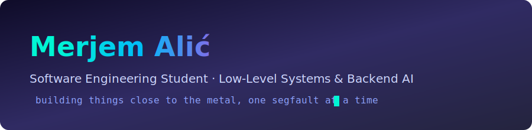

  

 

  
  
  

 

## About Me

- 🎓 Software Engineering student at **International Burch University**
- 🧠 Currently a **Backend AI Engineer Intern**
- ⚙️ Most interested in **low-level systems** — operating systems, parallel programming, CUDA
- 🐧 Comfortable on Linux, and I like knowing what's happening under the abstraction
- 🌱 Always looking for an excuse to get closer to the metal

## Skills

**Languages**

**Systems & Parallel Computing**

**Data & Backend**

**Web & Tools**

## GitHub Stats

  

> Generated by a scheduled GitHub Action that reads directly from the GitHub API — no third-party stats service, and HTML/CSS are excluded from the language breakdown since they'd otherwise dominate. See `scripts/generate-stats.js` if you want to tweak it.

## Contribution Graph

  

---

  Built by hand, self-hosted, no third-party dependencies for stats.

